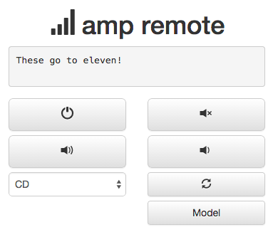

# nadapi

[](https://travis-ci.org/mpolden/nadapi)

A tool that implements the RS-232 protocol for NAD amplifiers. The protocol
documentation can be found [here](http://nadelectronics.com/software).

The tool has two modes:

* `server` - Serves a REST API where commands can be sent to the amplifier over HTTP.
* `send` - Sends a command directly to the amplifier and prints the response.

It's developed primarily for the NAD C356BEE, but should work for other NAD
amplifiers that have a RS-232 port.

## Usage

```
$ nadapi -h
Usage:
  nadapi [OPTIONS] <list | send | server>

Help Options:
  -h, --help  Show this help message

Available commands:
  list    List commands
  send    Send command
  server  Start API server
```

## Examples

Send command and print reply:

```
$ nadapi send 'model?'
Main.Model=C356BEE

$ nadapi send 'power?'
Main.Power=On

$ nadapi send 'power=off'
Main.Power=Off
```

Send a command using the REST API:

```
$ nadapi server -l :8666
2015/04/06 17:37:57 Listening on :8666
^Z

$ curl -d '{"variable": "model", "operator": "?"}' 'http://localhost:8666/api/v1/nad?pretty'
{
  "Variable": "Model",
  "Operator": "=",
  "Value": "C356BEE"
}
```

## Frontend

A basic webapp frontend is included in `static/`, and can be served by using the
`-s` option of the `server` subcommand.


